# LMPH JAVA BACK-END DEVELOPER EXAM

This demo application is a simple CRUD feature that add/delete/edit/view employees based on the user permission role. only Admin users has permission to Add/Delete/Edit. Regular user has only view permission.

## Tech Stack

- Java 17
- Maven 3.x
- Spring Boot 3
- MySQL 8.0
- Hibernate
- Flyway (for migration)
- JUnit 4
- GraphQL
- Thymeleaf (Template engine)
- Sonarqube (Code analysis and Lint)
- Boostrap 4 (Front-end library)


## Requirements

You must have the following applications installed in your machine to run this project:

- Java 17
- Docker or Docker Desktop for Windows
- Git

## Deploying the dockerized application

There is already a ready docker-compose file for running a dockerize application, You don't need to do build. The image application is available in this docker hub repo:
```
jhuntiballa/lmph-be-exam-app:latest
```

1. Clone the repo:
```
$ git clone https://github.com/junixdpirate/lmph-be-exam.git .
```
2. Go to the root folder in command line and execute the docker-compose command:

```
$ docker-compose -f docker-compose-app.yml up -d
```
3. Access the app in your browser
```
http://localhost:8080
```

4. Stop the application:
```
3. docker-compose -f docker-compose-app.yml down
```

## Development

The application has enabled a migration that will automatically create an empty database. And also uses Flyway migration for creating initial tables (employees, addresses and contacts). The database will persist even if you stop/restart the application as long as the docker container will not be stopped. When you stop/restart the docker container dependencies, the database will be reset.

<i>The application has not been tested in linux but you can try.</i>

1. Clone the repo if you haven't clone it yet:
```
$ git clone https://github.com/junixdpirate/lmph-be-exam.git .
```

2. Mysql and Sonarqube are dockerized. First, you have to stop the dockerized app if you run or deployed it, Mysql and the app are using the same port (3306 and 8080), It will cause port conflict if both app are running. See Deploying the dockerize application for stopping the app. 
Run the docker-compose:

```
$ docker-compose up -d
```

3. Go to the root folder in command line. Run build:
```
$ ./mvnw clean install
```
Alternatively, open the project in IntelliJ or STS and run the build command in your IDE.

Wait for the process to finished. You will see "BUILD SUCCESS" message.

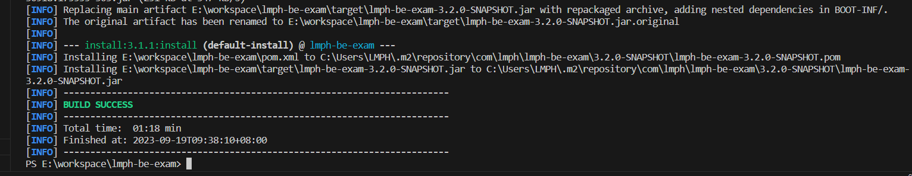

4. Running JUnit testing only
```
$ ./mvnw test
```

Wait for the process to finished. You will see "BUILD SUCCESS" message.

Alternatively, open the project in IntelliJ or STS and run the test command in your IDE.

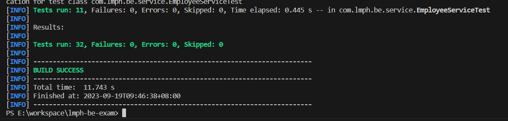

4. Deploy the application:
```
$ ./mvnw spring-boot:run
```

Wait for the application to start...

Alternatively, open the project in IntelliJ or STS and run the 'run' command in your IDE.

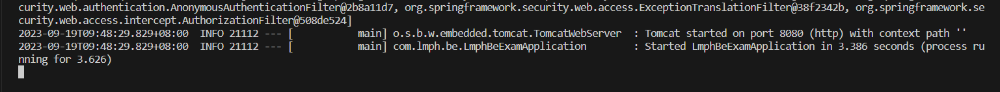

5. Stop the application. Execute this command:

For stopping spring boot application. In the command line, just do Ctrl+C and select Y if prompted. Or do the command line:
```
$ ./mvnw spring-boot:stop
```

For stopping the docker container dependencies
```
$ docker-compose down
```

## Accessing the app

- Default users: admin and user. password is lmph for both users.
- Admin user has permission for Add/Edit/Delete/View.
- User user has view permission only.

- Login using the provided users: admin or user
```
http://localhost:8080/login
```

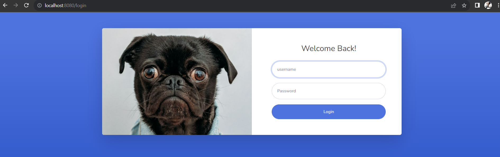

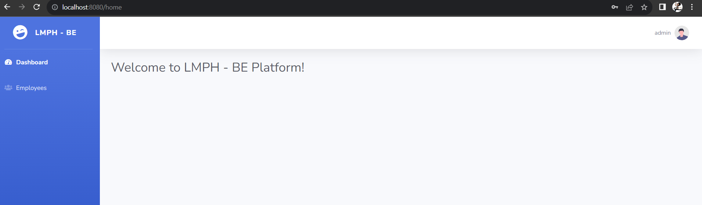


- In the left side menu, you can click the Employees link to go to Employees list
```
http://localhost:8080/employees
```

- If you have admin permission. you can see the 'Add', 'Edit' and 'Delete' buttons. and you can do as well.
```

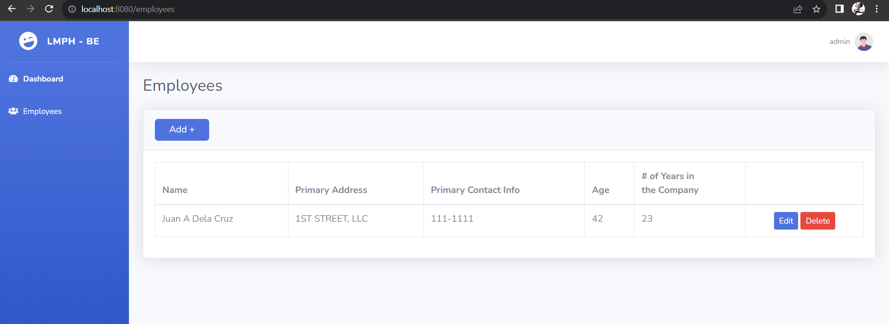

http://localhost:8080/employees/add
```

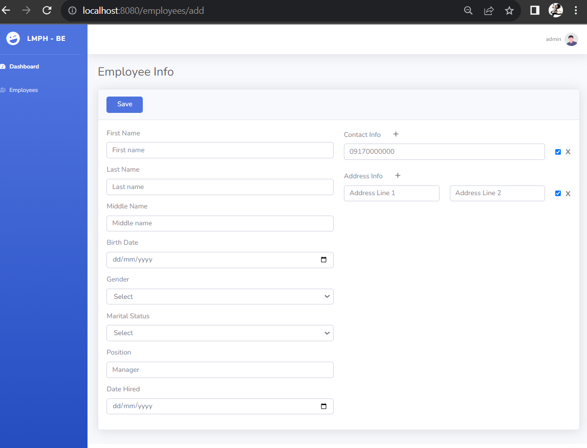

- Log out
```
http://localhost:8080/logout
```

## GraphQL interface and testing

You can access graphiql in here:
```
$ http://localhost:/8080/graphiql
```

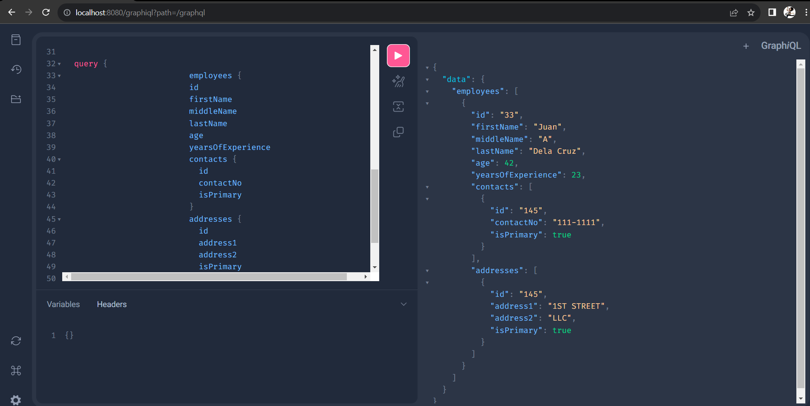


## Sonarqube

The sonarqube server is already included in dockerize dependencies and already available when you run the docker-compose.

you can access it here:
```
$ http://localhost:/9000
```
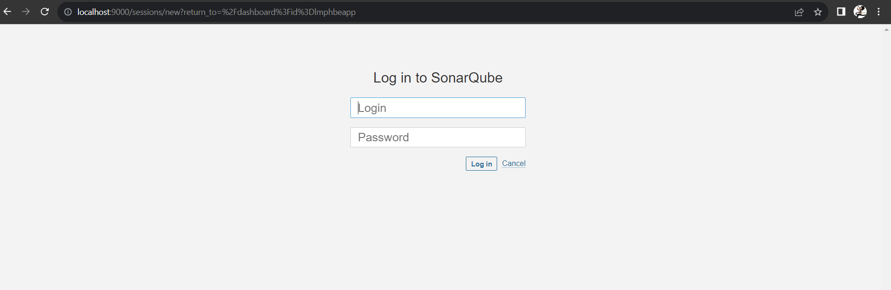

- Login to sonarqube and change the password as prompted. Default credentials: admin/admin. For testing purposes change the password to 'sonar'
- Create a project manually. use the project key 'lmph-be-exam'
- Enable all permissions for testing purposes. 
    - Goto global permissions. Administration > Security > Force user authentication. Uncheck the option
    - Goto project permission. [Your project] > Project Settings > Permissions. Check all permissions.
- Run the analysis. Go back to your project root folder in command line. Run this command:
```
$ ./mvnw verify sonar:sonar -Dsonar.login=admin -Dsonar.password=sonar
```

or if you created a token. use the token:

```
$ ./mvnw verify sonar:sonar -Dsonar.token=[token]
```
You will see the Build success and some information related to analysis.

<i>During in my testing. When executing ./mvnw verify sonar:sonar in command line, I get an "Unauthorized..." error from Sonarqube. If this happens, I recommend opening the project in STS (Spring Tool Suite 4). open a command line in the IDE and execute the command in there.</i>

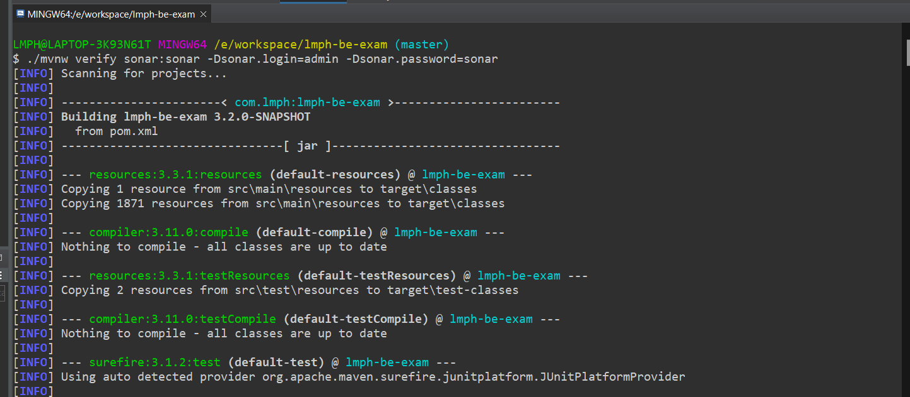

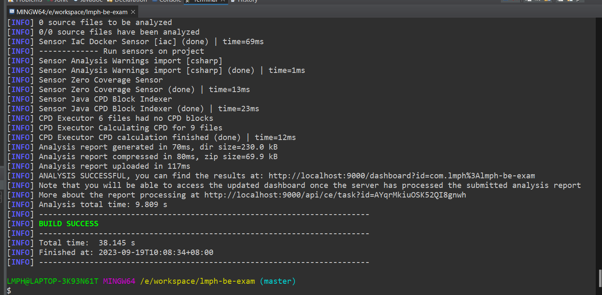

- Go back to Sonarqube server and you will see the analysis results.

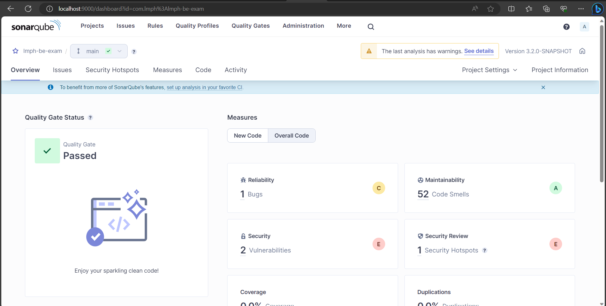